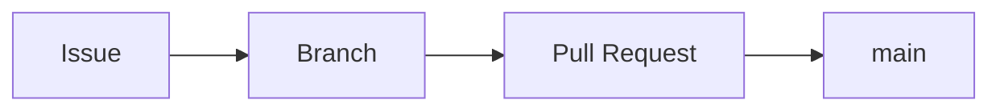

# Markdown-Referenz

Nachschlagewerk für die Formatierung in Markdown, abgestimmt auf Zensical und GitHub.

**Umgebung:** Zensical 0.0.x (Python Markdown) mit der Standardkonfiguration von `zensical new`, ergänzt um `pymdownx.quotes.callouts`; GitHub-Ansicht von `.md`-Dateien

## So ist diese Referenz aufgebaut

Markdown gibt es in mehreren Varianten («Dialekten»). Zensical verwendet **Python Markdown**, GitHub verwendet **GitHub Flavored Markdown**. Die Grundlagen sind gleich, im Detail gibt es Unterschiede. Deshalb steht bei jedem Element, wo es funktioniert:

- **Überall:** funktioniert in Zensical und in der GitHub-Ansicht.
- **Zensical (Erweiterung):** funktioniert nur, wenn die genannte Erweiterung in `zensical.toml` unter `[project.markdown_extensions]` aktiviert ist. Auf GitHub erscheint dann der rohe Text.

Faustregel: Was in der Vorschau mit `zensical serve` nicht richtig dargestellt wird, ist in der eigenen `zensical.toml` nicht aktiviert.

Für Dokumente, die auch auf GitHub gelesen werden (z. B. im Team-Repo), möglichst nur Elemente verwenden, die **überall** funktionieren.

## Teil 1: Grundlagen

### Überschriften

Überall.

```markdown
# Seitentitel (genau einmal pro Datei)
## Abschnitt
### Unterabschnitt
#### Unter-Unterabschnitt
```

- Die `#`-Überschrift ist der Seitentitel. Pro Datei genau **eine**.
- Ebenen nicht überspringen (nach `##` folgt `###`, nicht `####`).
- Die `##`- und `###`-Überschriften erscheinen in Zensical rechts im Inhaltsverzeichnis.

### Absätze und Zeilenumbrüche

Überall.

```markdown
Ein Absatz besteht aus einer oder mehreren Zeilen.
Diese Zeile gehört noch zum selben Absatz.

Eine Leerzeile beginnt einen neuen Absatz.
```

Ein einfacher Zeilenumbruch im Quelltext erzeugt **keinen** Umbruch in der Darstellung. Für einen neuen Absatz immer eine Leerzeile einfügen.

### Textformatierung

| Syntax | Ergebnis | Wo |
|---|---|---|
| `**fett**` | **fett** | überall |
| `*kursiv*` | *kursiv* | überall |
| `***fett und kursiv***` | ***fett und kursiv*** | überall |
| `` `Code` `` | `Code` | überall |
| `~~durchgestrichen~~` | ~~durchgestrichen~~ | GitHub; Zensical mit `pymdownx.tilde` |
| `==markiert==` | ==markiert== | nur Zensical mit `pymdownx.mark` |

Tipp: Dateinamen, Befehle, Pfade und Werte immer als `Code` formatieren, z. B. `zensical.toml` oder `git status`. So sind sie klar vom Fliesstext unterscheidbar.

### Ungeordnete Listen

Überall.

```markdown
- Erster Punkt
- Zweiter Punkt
    - Unterpunkt (4 Leerzeichen eingerückt)
    - Noch ein Unterpunkt
- Dritter Punkt
```

**Wichtig:** Python Markdown verlangt für Unterpunkte und weitere Inhalte in Listen eine Einrückung von **4 Leerzeichen**. GitHub akzeptiert auch 2, aber 4 funktionieren überall. Deshalb immer 4 verwenden.

Innerhalb einer Liste immer dasselbe Zeichen verwenden (`-`). Python Markdown beginnt beim Wechsel von `-` zu `*` keine neue Liste, andere Varianten schon.

### Nummerierte Listen

Überall.

```markdown
1. Erster Schritt
2. Zweiter Schritt
3. Dritter Schritt
```

Soll ein Listenpunkt weitere Absätze oder einen Codeblock enthalten, müssen diese mit **4 Leerzeichen** eingerückt sein, sonst endet die Liste:

````markdown
1. Ersten Befehl ausführen:

    ```powershell
    git status
    ```

2. Zweiter Schritt
````

Bei längeren Anleitungen mit viel Code sind **Zwischenüberschriften** (`### 1. Schritt`) oft robuster als nummerierte Listen.

### Aufgabenlisten

GitHub; Zensical mit `pymdownx.tasklist`.

```markdown
- [x] Erledigt
- [ ] Offen
```

### Links

Überall.

```markdown
[Linktext](https://zensical.org)
[Andere Seite im selben Ordner](andere-seite.md)
[Seite in einem Unterordner](git/spickzettel.md)
[Seite im übergeordneten Ordner](../index.md)
[Abschnitt auf derselben Seite](#textformatierung)
[Abschnitt auf einer anderen Seite](git/spickzettel.md#11-branches)
```

- Interne Links immer **relativ** und auf die `.md`-Datei setzen, nicht auf `.html`. Zensical rechnet sie beim Bauen richtig um und warnt bei kaputten Zielen.
- Pfade sind relativ zur **aktuellen Datei**, nicht zum `docs/`-Ordner.
- Anker (`#...`) entstehen aus der Überschrift: Kleinbuchstaben, Leerzeichen werden zu `-`, Satzzeichen fallen weg. Bei Unsicherheit in der Vorschau auf das ¶-Zeichen neben der Überschrift klicken und den Link aus der Adresszeile übernehmen.

### Bilder

Überall.

```markdown

```

- Der Text in `[...]` ist der Alternativtext. Er wird angezeigt, wenn das Bild fehlt, und von Screenreadern vorgelesen. Immer sinnvoll ausfüllen.
- Bilder neben die Seite legen, z. B. in einen Unterordner `bilder/` im selben Themenordner. Dann lassen sich Themen später samt Bildern verschieben.

### Codeblöcke

Überall.

````markdown
```powershell
# Kommentar
git status
```
````

- Nach den drei Backticks die **Sprache** angeben, damit die Farbhervorhebung stimmt. Häufige Kürzel: `powershell`, `bash`, `python`, `sql`, `json`, `toml`, `yaml`, `html`, `markdown`, `text` (keine Hervorhebung, z. B. für Fehlermeldungen oder Dateiinhalte wie `.gitignore`).
- Öffnen und schliessen immer mit **gleich vielen** Backticks.
- Enthält der Codeblock selbst drei Backticks (wie die Beispiele in dieser Referenz), den äusseren Block mit **vier** Backticks einfassen.

### Zitate

Überall.

```markdown
> Dies ist ein Zitat.
> Es kann mehrere Zeilen umfassen.
```

### Tabellen

Überall.

```markdown
| Befehl | Zweck |
|---|---|
| `git status` | Zustand anzeigen |
| `git pull` | Änderungen holen |
```

- Die zweite Zeile (`|---|---|`) trennt Kopf und Inhalt und ist Pflicht.
- Ausrichtung: `|:---|` links, `|:---:|` zentriert, `|---:|` rechts.
- Die Spalten im Quelltext müssen nicht bündig sein, das ist nur Kosmetik.
- Ein `|` im Zelleninhalt mit `\|` schreiben.

### Fussnoten

Überall (Zensical mit `footnotes`).

```markdown
Ein Satz mit Fussnote.[^1]

[^1]: Text der Fussnote. Er erscheint am Seitenende.
```

So sieht es aus: Ein Satz mit Fussnote.[^beispiel]

[^beispiel]: Dies ist eine echte Fussnote. Sie steht am Ende der Seite.

- Die Kennung in `[^...]` ist frei wählbar (`[^1]`, `[^quelle]`). Die Nummerierung in der Darstellung erfolgt automatisch.
- Die Fussnotendefinition kann irgendwo in der Datei stehen; übersichtlich ist direkt nach dem Absatz oder gesammelt am Ende.
- Praktisch für Quellenangaben oder Nebenbemerkungen, die den Lesefluss stören würden.

### Diagramme (Mermaid)

Überall (Zensical mit `pymdownx.superfences` und der `mermaid`-Einstellung).

Diagramme werden als Text in einem Codeblock mit der Sprache `mermaid` beschrieben und beim Anzeigen gezeichnet:

````markdown

````

So sieht es aus:


- `flowchart LR` zeichnet von links nach rechts, `flowchart TD` von oben nach unten.
- `A[Text]` ist ein Kasten, `A{Text}` eine Raute (Entscheidung), `A --> B` ein Pfeil, `A -->|Beschriftung| B` ein beschrifteter Pfeil.
- Neben Ablaufdiagrammen gibt es u. a. Sequenzdiagramme (`sequenceDiagram`) und Zeitachsen (`gantt`). Übersicht unter [mermaid.js.org](https://mermaid.js.org).
- Vorteil gegenüber Bildern: Das Diagramm ist Text, lässt sich mit Git versionieren und in jedem Editor ändern.

### Horizontale Linie

Überall.

```markdown
---
```

Vor und nach `---` eine Leerzeile lassen, sonst wird die Zeile darüber unter Umständen als Überschrift interpretiert.

### Sonderzeichen maskieren

Überall. Zeichen, die Markdown als Formatierung versteht, mit `\` davor als normales Zeichen schreiben:

```markdown
\*kein kursiv\*
\# keine Überschrift
```

### Kommentare

Überall. Text, der in der Darstellung nicht erscheint:

```markdown
<!-- Notiz für mich: Abschnitt noch prüfen -->
```

Achtung: Der Kommentar ist in der Quelldatei und im HTML-Quelltext der Seite sichtbar. Keine vertraulichen Inhalte hineinschreiben.

## Teil 2: Zensical-Erweiterungen

Diese Elemente funktionieren nur in Zensical und nur, wenn die Erweiterung aktiviert ist. Auf GitHub erscheint roher Text.

### Hinweisboxen (Admonitions)

Zensical mit `admonition`, `pymdownx.details` und `pymdownx.superfences`.

```markdown
!!! note

    Inhalt, mit 4 Leerzeichen eingerückt.

!!! warning "Eigener Titel"

    Inhalt mit eigenem Titel.

??? tip "Aufklappbar, anfangs geschlossen"

    Inhalt erscheint erst nach Klick.

???+ info "Aufklappbar, anfangs offen"

    Inhalt ist sofort sichtbar.
```

Verfügbare Typen: `note`, `abstract`, `info`, `tip`, `success`, `question`, `warning`, `failure`, `danger`, `bug`, `example`, `quote`.

Der Inhalt **muss** mit 4 Leerzeichen eingerückt sein, sonst gehört er nicht zur Box.

### Hinweisboxen im GitHub-Stil (Callouts)

Zensical mit `pymdownx.quotes` und der Option `callouts = true`. Funktioniert **auch auf GitHub**.

```markdown
> [!NOTE]
> Hinweis, der in Zensical und auf GitHub als Box erscheint.

> [!WARNING]
> Warnung.
```

GitHub kennt die Typen `NOTE`, `TIP`, `IMPORTANT`, `WARNING` und `CAUTION`. Die Kennzeichnung muss in **Grossbuchstaben** geschrieben sein.

Für Team-Dokumente, die auch auf GitHub gelesen werden, ist diese Schreibweise den `!!!`-Boxen vorzuziehen.

Aktivieren in `zensical.toml`: im bestehenden Abschnitt `[project.markdown_extensions]` diese Zeile ergänzen (keinen neuen Abschnitt anlegen):

```toml
# GitHub-Callouts (> [!NOTE] usw.) in Zensical als Box darstellen
pymdownx.quotes.callouts = true
```

So sieht es aus (erscheint nur als Box, wenn die Zeile aktiv ist):

> [!TIP]
> Wenn du diesen Text in einer Box siehst, funktionieren die Callouts.

### Codeblöcke mit Titel, Zeilennummern und Hervorhebung

Zensical mit `pymdownx.highlight` und `pymdownx.superfences`.

````markdown
```python title="beispiel.py"
print("Codeblock mit Titel, z. B. Dateiname")
```

```python linenums="1"
print("Codeblock mit Zeilennummern ab 1")
```

```python hl_lines="2 3"
zeile_1 = 1
zeile_2 = 2   # hervorgehoben
zeile_3 = 3   # hervorgehoben
```
````

Die Optionen lassen sich kombinieren: ` ```python title="x.py" linenums="1" hl_lines="2" `.

### Kopier-Button für Codeblöcke

Keine Syntax, sondern eine Einstellung in `zensical.toml`, in der Standardkonfiguration bereits aktiv. Fügt jedem Codeblock einen Button zum Kopieren hinzu:

```toml
[project.theme]
# Kopier-Button in allen Codeblöcken; falls "features" schon existiert, dort ergänzen
features = [
  "content.code.copy",
]
```

### Inhalts-Tabs

Zensical mit `pymdownx.tabbed` und `pymdownx.superfences`.

Praktisch für Varianten desselben Inhalts, z. B. Befehle für verschiedene Betriebssysteme:

````markdown
=== "Windows"

    ```powershell
    .venv\Scripts\Activate.ps1
    ```

=== "macOS / Linux"

    ```bash
    source .venv/bin/activate
    ```
````

So sieht es aus:

=== "Windows"

    ```powershell
    .venv\Scripts\Activate.ps1
    ```

=== "macOS / Linux"

    ```bash
    source .venv/bin/activate
    ```

- Der Inhalt jedes Tabs **muss** mit 4 Leerzeichen eingerückt sein.
- Aufeinanderfolgende `===`-Blöcke bilden eine Tab-Gruppe. Eine Leerzeile dazwischen ist erlaubt, ein anderer Absatz beendet die Gruppe.
- Auf GitHub erscheinen die Tabs als roher Text mit den `===`-Zeilen. In Dokumenten, die auf GitHub gelesen werden, die Varianten besser als `###`-Unterabschnitte schreiben.

### Tastenkürzel

Zensical mit `pymdownx.keys`.

| Syntax | Ergebnis |
|---|---|
| `++ctrl+c++` | ++ctrl+c++ |
| `++ctrl+shift+p++` | ++ctrl+shift+p++ |
| `++alt+tab++` | ++alt+tab++ |
| `++enter++` | ++enter++ |

- Tasten mit `+` verbinden und das Ganze in `++` einfassen.
- Die Tastennamen sind englisch (`ctrl`, `shift`, `alt`, `enter`, `tab`, `esc`), die Darstellung erfolgt als Tastensymbol.
- Auf GitHub erscheint der rohe Text. Wo das stört, stattdessen `Strg+C` als Code schreiben.

## Teil 3: Typische Fehler

| Problem | Ursache | Lösung |
|---|---|---|
| Seite hat keinen oder falschen Titel | Erste Zeile ist keine `#`-Überschrift oder es gibt mehrere | Genau eine `#`-Überschrift am Anfang |
| Unterpunkte erscheinen nicht eingerückt | Nur 2 Leerzeichen Einrückung | 4 Leerzeichen verwenden |
| Nummerierung beginnt immer wieder bei 1 | Nicht eingerückter Text zwischen den Listenpunkten | Inhalte mit 4 Leerzeichen einrücken oder Zwischenüberschriften verwenden |
| Codeblock «läuft» bis zum Dateiende | Öffnende und schliessende Backticks ungleich | Gleich viele Backticks verwenden |
| Hinweisbox ist leer, Text steht darunter | Inhalt nicht eingerückt | 4 Leerzeichen Einrückung |
| Link führt ins Leere | Absoluter Pfad oder Link auf `.html` | Relativen Link auf die `.md`-Datei setzen |
| `!!! note` erscheint als Text | Erweiterung nicht aktiviert oder Ansicht auf GitHub | In `zensical.toml` aktivieren bzw. Callout-Schreibweise verwenden |
| Liste klebt am Absatz davor | Keine Leerzeile vor der Liste | Leerzeile vor Listen, Codeblöcken und Tabellen |
| Tab ist leer, Inhalt steht darunter | Inhalt des Tabs nicht eingerückt | 4 Leerzeichen Einrückung |
| Diagramm erscheint als Code | Sprache nicht genau `mermaid` oder Syntaxfehler im Diagramm | Sprache prüfen; Diagramm im [Mermaid Live Editor](https://mermaid.live) testen |

## Quellen

- [Zensical: Markdown](https://zensical.org/docs/authoring/markdown/)
- [Zensical: Admonitions](https://zensical.org/docs/authoring/admonitions/)
- [Zensical: Code blocks](https://zensical.org/docs/authoring/code-blocks/)
- [Zensical: Content tabs](https://zensical.org/docs/authoring/content-tabs/)
- [Zensical: Diagrams](https://zensical.org/docs/authoring/diagrams/)
- [Zensical: Footnotes](https://zensical.org/docs/authoring/footnotes/)
- [Mermaid: Dokumentation](https://mermaid.js.org)
- [Python Markdown: Unterschiede zu anderen Varianten](https://python-markdown.github.io/#differences)
- [GitHub: Grundlegende Formatierungssyntax](https://docs.github.com/de/get-started/writing-on-github/getting-started-with-writing-and-formatting-on-github/basic-writing-and-formatting-syntax)
- [Markdown Guide (allgemeine Einführung)](https://www.markdownguide.org)
